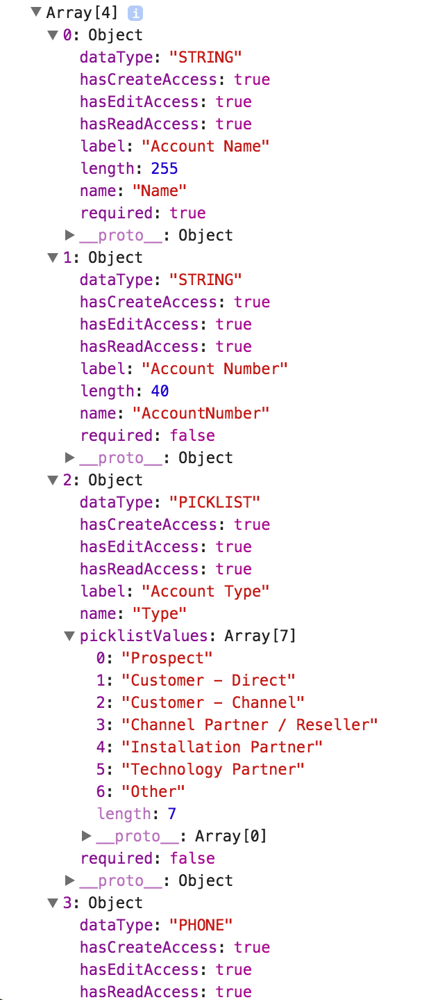

# FieldSetReactor

The core concept of this project is to allow a Salesforce developer to create user interfaces that are aware of **Field Set** metadata types, and tailor the standard HTML markup to meet the current user's permissions and the field configuration.

This project spawned from a requirement to create dynamic UIs with React, and ensure that administrators (or non-React developers) would be able to change specific layouts and adhere to the permissions set up for their userbase.

## Installation

If you'd like to install from a package link, feel free to use one of these links to install to your [production](https://login.salesforce.com/packaging/installPackage.apexp?p0=04t61000000kf6k) or [sandbox](https://test.salesforce.com/packaging/installPackage.apexp?p0=04t61000000kf6k) orgs. Note that this package includes a field set for the User object called **FieldSetReactor**, which is required to allow the **FieldSetReactorTest** coverage to pass when installing; the limitation is that test coverage cannot simulate the creation of a field set, and since this package is all about field sets... you get the gist :)

Otherwise, feel free to pull the `FieldSetReactor.cls` file directly and use it in your projects. You can use the rudimentary example of `FieldSetReactorTest.cls` to aid in your coverage, and suggest that you test more attributes of the `FieldSetReactor.FieldDetails` object based on your team's use case.

## Example Implementation

A Visualforce page called `AccountManager` makes a call to the page's controller before the DOM content has loaded, as the developer wishes to retrieve the `Fields_To_Display` field set and details about each field. The developer would include the following JavaScript call, and likely would use the return from the `@RemoteAction` method in its callback to continue building DOM elements with appropriate attribute values.

```js
Visualforce.remoting.Manager.invokeAction('Controller.getFields', 'Fields_To_Display', 'Account',
	function(result, event) {
		// do something with the resulting object returned
	}
);
```

The method call to the controller will return an object of objects, where each child object is the field name.
```java
@RemoteAction
public static List<FieldSetReactor.FieldDetails> getFields(String fieldSetName, String objectName)
{
  return FieldSetReactor.getFieldDetails(fieldSetName, objectName);
}
```

Here's a resulting screenshot if the user were to `console.log(result)` in the callback function above.
